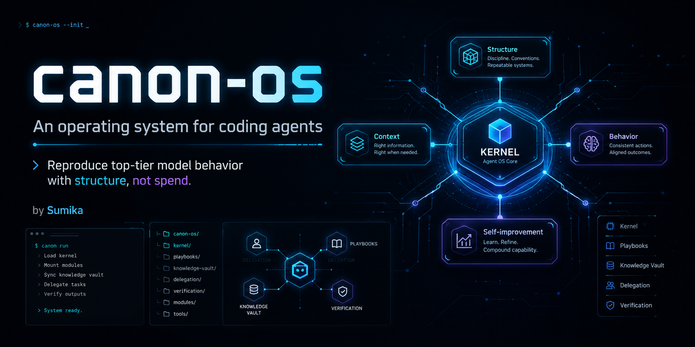

# canon-os



**English** | [日本語](README.ja.md)

**An operating system for coding agents. Reproduce a top-tier model's *behavior* with structure — not spend.**

*by Sumika*

When the strongest models move to metered, pay-per-use pricing, you still want your everyday agent to work with
the same discipline: conclusion-first, act without dithering, verify against real output, don't leak, don't
sprawl. canon-os is a small, plain-text kernel + playbooks + behavior style that makes a mid-tier model
*behave* like a disciplined senior — and reserves the expensive tier for what only it can do.

It's the generic, personal-data-free core of a private agent OS, extracted for anyone to install.

## The thesis: three pillars + self-improvement

Quality is reproduced by **structure**, not raw intelligence:

1. **Structure** — a constitution, a delegation policy, an unknown-unknown discovery protocol, and launch
   playbooks. Multi-perspective panels + adversarial synthesis + canonization.
2. **Context** — a two-layer (raw / compiled) knowledge vault with source-receipts and an index-first read
   discipline, so the knowledge base gets *stronger* with size instead of noisier.
3. **Behavior** — an [operating style](behavior/operating-style.md) that injects the "feel" of a top-tier model
   (conclusion-first, act, verify, re-land) into any model via your tool's system-prompt mechanism.
4. **Self-improvement** — monthly/quarterly maintenance reviews, a decisions log, deprecation rules, and an
   unknowns ledger, so the system stays true to reality instead of rotting.

A model's raw capability isn't transferred by a prompt. So the [delegation policy](kernel/delegation-policy.md)
still routes the hardest judgment to the top tier — while everything else runs disciplined and cheap.

## Context economy

Treat context like a budget, not a given. Give every worker a strict return format and a line cap so its
report — not its raw transcript — is what comes back. Read through the index first; pull a whole file only
when a decision actually needs it, and never re-read a worker's transcript directly. Write decisions to a
file every turn — context is volatile, files survive compaction. Full rule set:
[playbooks/session-operations.md](playbooks/session-operations.md).

## Quick start

```sh
git clone <this-repo> canon-os && cd canon-os && ./install.sh
```

or paste [INSTALL_PROMPT.md](INSTALL_PROMPT.md) into a coding agent and let it wire itself in.
Full options and manual steps: [INSTALL.md](INSTALL.md). Map model tiers in [MODELS.md](MODELS.md).

Works with **Claude Code** (via output styles) and **AGENTS.md-style tools** (Codex, etc.). Model-agnostic.

## Layout

- `kernel/` — always-loaded norms: [constitution](kernel/constitution.md),
  [delegation-policy](kernel/delegation-policy.md), [security-floor](kernel/security-floor.md),
  [vault-policy](kernel/vault-policy.md)
- `behavior/` — the [operating style](behavior/operating-style.md) + [sub-agent preamble](behavior/subagent-preamble.md)
- `playbooks/` — unknown-unknown protocol, project launch, kickoff, project audit, maintenance review,
  session operations
- `checklists/` — the [value gate](checklists/value-gate.md)
- `templates/` — project agent file, implementation notes, progress, handoff, charter, decision, sub-agent preamble
- `maintenance/` — deprecation rules + starters for the review log, decisions, and backlog
- `INDEX.md` — the front door; read it first

## Attribution

canon-os stands on ideas made public by others:

- The behavioral-style transfer approach is adapted from a public write-up by **@connect24h** on X, and from
  **Claude Code's output-styles** documentation (code.claude.com/docs).
- The two-layer knowledge-vault pattern is adapted from the "second brain" pattern popularized in a public
  write-up by **Machina (@EXM7777)** on X.
- The delegation tip — let the strong model route routine work to cheaper models — echoes **Simon Willison**'s
  writing on agent operation.

## License

MIT © 2026 Sumika. See [LICENSE](LICENSE).
